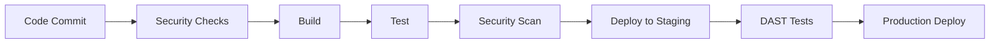

# DevSecOps Pipeline Demo

This repository demonstrates a comprehensive DevSecOps implementation, showcasing modern security practices integrated into the CI/CD pipeline. It serves as a practical example of how to implement security-first development practices in a modern web application environment.

## 🔒 Security Features Implemented

### 1. Automated Security Testing
- **SAST (Static Application Security Testing)**
  - SonarQube integration for code quality and security analysis
  - Semgrep for pattern-based vulnerability detection
  - Custom security rules enforcement
  
- **DAST (Dynamic Application Security Testing)**
  - OWASP ZAP integration for automated security scanning
  - API security testing with custom scripts
  
- **SCA (Software Composition Analysis)**
  - Dependency scanning with Snyk
  - OWASP Dependency-Check integration
  - Container image scanning with Trivy

### 2. Security Controls
- Secrets management with HashiCorp Vault
- Infrastructure as Code (IaC) security scanning
- Container security with policies and best practices
- Runtime application security monitoring

### 3. Compliance & Governance
- Automated compliance checks
- Security policy as code
- Audit logging and monitoring
- Automated security documentation

## 🔄 CI/CD Pipeline Structure



## 🚀 Getting Started

### Prerequisites
- Docker 20.10+
- Kubernetes 1.24+
- Helm 3.8+
- Python 3.9+

### Quick Start
1. Clone the repository
```bash
git clone https://github.com/moelhaj996/devsecops-pipeline-demo.git
cd devsecops-pipeline-demo
```

2. Install dependencies
```bash
make setup
```

3. Run security checks locally
```bash
make security-check
```

## 📊 Security Metrics & KPIs

- MTTR (Mean Time to Remediate) tracking
- Security debt monitoring
- Vulnerability trending
- Code coverage for security tests
- Security compliance score

## 🛠 Tools & Technologies

- **CI/CD**: GitHub Actions, ArgoCD
- **Security Testing**: 
  - SonarQube
  - OWASP ZAP
  - Snyk
  - Trivy
- **Infrastructure**: 
  - Terraform
  - Kubernetes
  - Helm
- **Monitoring**: 
  - Prometheus
  - Grafana
  - ELK Stack

## 📝 Documentation

- [Security Controls Implementation](./docs/security-controls.md)
- [Threat Modeling](./docs/threat-modeling.md)
- [Security Policies](./docs/security-policies.md)
- [Incident Response](./docs/incident-response.md)

## 🔐 Security Best Practices

This repository implements the following security best practices:

1. **Shift-Left Security**
   - Security testing integrated early in development
   - Developer security awareness training
   - Automated security checks in IDE

2. **Zero Trust Architecture**
   - Identity-based access control
   - Network segmentation
   - Least privilege principle

3. **Continuous Security Monitoring**
   - Real-time threat detection
   - Automated vulnerability scanning
   - Security metrics dashboard

## 🤝 Contributing

Please read our [Contributing Guidelines](CONTRIBUTING.md) for details on our code of conduct and the process for submitting pull requests.

## 📄 License

This project is licensed under the MIT License - see the [LICENSE](LICENSE) file for details.

## 🔗 Additional Resources

- [Security Architecture Overview](./docs/architecture.md)
- [Pipeline Configuration Guide](./docs/pipeline-config.md)
- [Security Tools Integration](./docs/tools-integration.md)